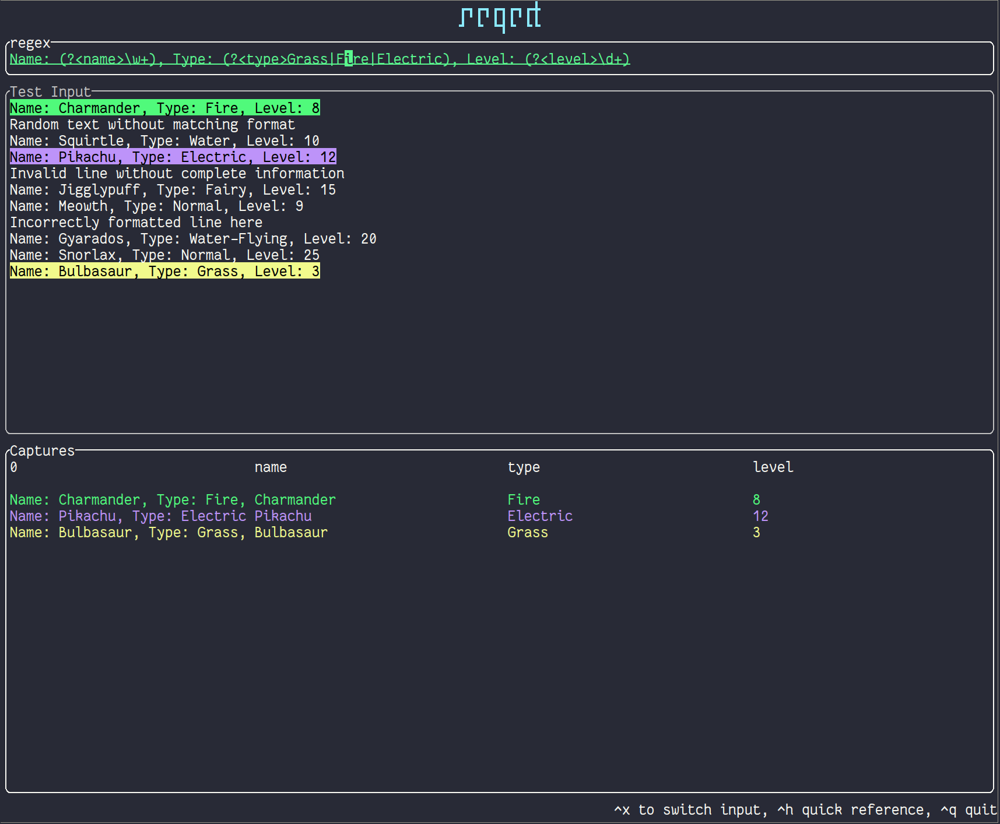

# Regect

regex 101 like cli tool

# Run

```bash
regect
```

# Input and Output

```bash
cat input.txt | regect > filtered_output.txt
```

# Install

```bash
cargo install regect --locked
```

## Binaries

Check [Releases](https://github.com/kloki/regect/releases) for binaries and installers
